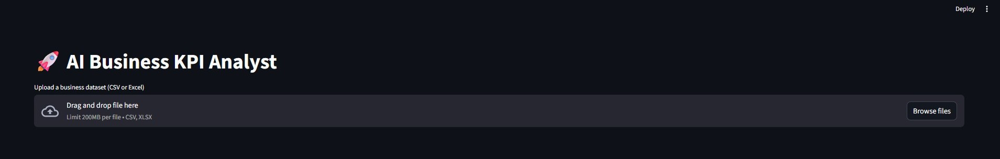
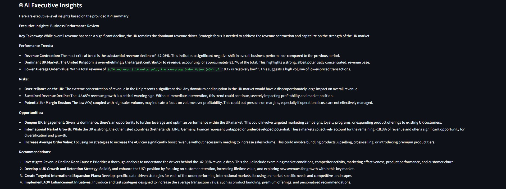
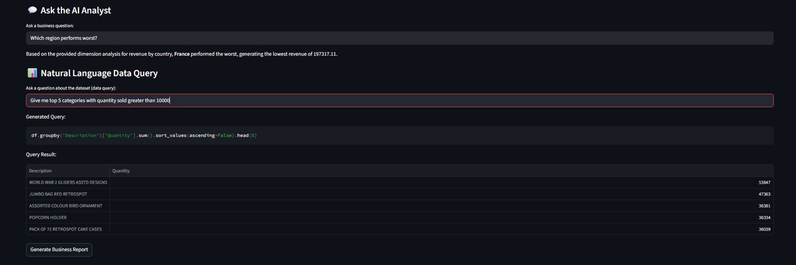

# AI Business KPI Analyst

AI Business KPI Analyst is an AI-powered analytics application that automatically analyzes business datasets, generates KPIs, and produces executive insights using AI.

The system simulates an **AI-powered business analyst** capable of profiling datasets, calculating key performance metrics, identifying trends, and answering business questions through natural language.

Users can upload a dataset and instantly receive automated performance analysis, KPI dashboards, and AI-generated business explanations.

---

## Problem Statement

Business teams often rely on analysts to manually clean datasets, calculate KPIs, and interpret trends. This project demonstrates how AI and automated analytics pipelines can assist in performing these tasks instantly.

The system simulates an **AI-powered business analyst** capable of analyzing datasets and explaining performance trends.

---

## Key Highlights

- Built a modular **analytics pipeline architecture**
- Automated **KPI generation and trend detection**
- Integrated **Gemini AI for executive business insights**
- Implemented **Ask-Your-Data natural language interface**
- Developed an **interactive Streamlit dashboard**
- Generated **automated downloadable business reports**

## System Architecture

Raw Dataset
     │
     ▼
Data Profiling
     │
     ▼
Cleaning Pipeline
     │
     ▼
Structured Dataset
     │
     ▼
KPI Computation
     │
     ▼
Dimension Analysis
     │
     ▼
Analytical Signals + Anomaly Detection
     │
     ▼
Structured Business Context
     │
     ▼
AI Interpretation (Gemini)
     │
     ▼
Insights + Q&A + Executive Brief
     │
     ▼
Dashboard + Downloadable Reports

---

## Features

- Automated dataset ingestion
- Rule-based data cleaning pipeline
- Automatic KPI generation
- Dynamic categorical dimension analysis
- AI-generated executive insights
- Interactive Ask-Your-Data interface
- Streamlit web application
- Automated business report generation (PDF)

## Application Preview

### Dashboard

### KPI

### AI Insights

### AI Analyst

---

## Ask Your Data (AI Analyst)

Users can ask natural language questions about their dataset.

Example questions:

- Which country generates the most revenue?
- Which month performed worst?
- Which category drives the most sales?
- Is revenue improving over time?
- Summarize overall business performance.

The system builds structured context from KPIs and sends it to Gemini AI to generate business explanations.

---

## Tech Stack

Python — Core application logic  
Pandas — Data processing and KPI calculations  
Streamlit — Interactive web application  
Google Gemini API — AI-generated insights and question answering  
ReportLab — Automated PDF report generation  
python-dotenv — Secure API key management

---

## Demo Datasets

Sample datasets are provided in the `sample_data/` directory for quick testing.

Included datasets:

- **Online Retail** — Transactional retail dataset with country-level sales.
- **Superstore Sales** — Retail dataset with region, category, and segment dimensions.
- **Brazilian E-Commerce** — Multi-table e-commerce dataset containing order and customer information.

Users can upload any of these datasets directly in the Streamlit application to explore KPI analysis and AI-generated insights.

### Brazilian E-Commerce Dataset Note

The original dataset contains several relational tables.
Due to GitHub file size limits, the full geolocation dataset is not included in this repository.

A smaller sample file is provided instead.

The complete dataset can be downloaded from Kaggle:
https://www.kaggle.com/datasets/olistbr/brazilian-ecommerce

## How to Run

Clone the repository: https://github.com/KarthikKumarP-475/AI-KPI-Analyst.git

Install dependencies: python -m pip install -r requirements.txt

Add your Gemini API key in `.env`: GEMINI_API_KEY=your_api_key_here

Run the application: streamlit run app.py

## Development Timeline

Day 1 — Data ingestion and cleaning pipeline  
Day 2 — KPI engine and trend analysis  
Day 3 — Insight engine  
Day 4 — Gemini AI integration  
Day 5 — Ask-Your-Data interface  
Day 6 — Streamlit application  
Day 7 — Documentation improvements  
Day 8 — PDF report generation  
Day 9 — Dimension analysis
Day 10 — Final Polish

## Version 2 Enhancements — Analytical Signal Engine

## Day 11 Progress — Analytical Signals
Introduced an analytical signal engine to enhance business intelligence capabilities.

The system now derives higher-level signals from KPI outputs to provide deeper performance interpretation before AI analysis.

Signals implemented:

• Revenue growth rate  
• Revenue volatility  
• Revenue trend classification  
• Market concentration indicators  
• Top-3 revenue concentration risk

These signals provide structured analytical context that improves the quality of AI-generated executive insights.

## Day 12 Progress — Revenue Trend Visualization

Added a revenue trend visualization to the dashboard.

The application now displays a monthly revenue trend chart derived from KPI engine outputs. This allows users to visually analyze revenue growth patterns, volatility, and seasonal fluctuations before reviewing AI-generated insights.

## Day 13 Progress — Structured AI Question Context

Improved the Ask-Your-Data system by providing structured analytical context to the AI model.

The question engine now supplies KPIs, analytical signals, dimension analysis, and trend data when answering user questions. This significantly improves the quality and reliability of AI-generated explanations.

## Day 14 Progress — Automatic Dataset Understanding

Added an AI-powered dataset understanding module.

When a dataset is uploaded, the system now analyzes the dataset structure and explains:

• The likely business domain of the dataset  
• Which columns may represent revenue or quantity  
• Which categorical dimensions can drive analysis  

This feature helps users quickly understand the structure and analytical potential of their data.

## Day 15 Progress — Smart Dataset Type Detection

Enhanced the dataset understanding module with automatic dataset type detection.

The system now analyzes uploaded datasets and classifies them into common business data categories such as retail sales, e-commerce orders, financial transactions, or inventory datasets.

This allows the AI insight engine to provide more contextual business explanations.

## Day 16 Progress — KPI Growth Indicators

Enhanced the dashboard with KPI growth indicators.

The system now calculates month-over-month revenue change and displays growth indicators directly within KPI cards. Positive and negative changes are visualized using directional indicators, improving the interpretability of performance metrics.

## Day 17 Progress — Revenue Anomaly Detection

Added automated anomaly detection for revenue trends.

The system now analyzes monthly revenue patterns and identifies significant spikes or drops using statistical thresholds. Detected anomalies are displayed in the dashboard and included in AI-generated insights.

## Day 18 Progress — AI Executive Brief Generator

Added an AI-powered executive brief generator.

The system now produces a concise business summary based on KPIs, analytical signals, and dimension analysis. Users can download the generated executive brief for quick sharing in reports or presentations.

## Day 19 Progress — Natural Language Data Queries

Added an AI-powered data query engine that converts natural language questions into executable pandas queries.

Users can now ask analytical questions such as "Top countries by revenue" or "Highest revenue month," and the system generates and executes the corresponding pandas query on the dataset.

## Day 20 Progress — Dimension Visualization

Enhanced the dimension analysis section with interactive bar charts.

Top-performing categories such as country, product category, or customer segment are now visualized using bar charts, making it easier to compare business performance across dimensions.

## Day 21 Progress — Pipeline Stability Improvements

Added safety guards to prevent failures when datasets contain missing or insufficient data.

The system now validates cleaned datasets before executing KPI computations and analytical signal generation, ensuring the application fails gracefully when encountering incomplete datasets.

## Day 22 Progress — Dataset Preview

Added a dataset overview and preview section to the dashboard.

Users can now view dataset size, missing values, and the first rows of the uploaded dataset before running analytics, improving transparency and usability.

## Day 23 Progress — Cleaned Dataset Export

Added the ability to download the cleaned dataset after the data cleaning pipeline runs.  
Users can now export the processed dataset as a CSV file for further analysis or validation.

## Day 24 Progress — Detected Column Mapping

Added a detected column mapping section to the dashboard.

The system now displays which dataset columns are used for revenue, quantity, and date calculations, improving transparency and helping users understand how KPIs are generated.

## Day 25 Progress — Interactive Dataset Filters

Added interactive filters that allow users to dynamically restrict the dataset by categorical dimensions such as country or category. All analytics, KPIs, and AI insights automatically update based on the filtered dataset.

## Day 26 Progress — Smart Chart Visualization

Improved dashboard visualization by introducing structured chart rendering for time-series and categorical analysis. Dimension charts now include expandable data tables and support chart/table view toggling for better data exploration.

## Day 27 Progress — Smart Number Formatting

Improved dashboard readability by introducing automatic large-number formatting (K, M, B). This enhances KPI cards and dimension tables for clearer business presentation.

## Future Improvements

- Profit and margin analysis
- Customer cohort analysis
- Multi-table relational dataset support
- Advanced analytics signals (volatility, concentration)
- Interactive visual dashboards